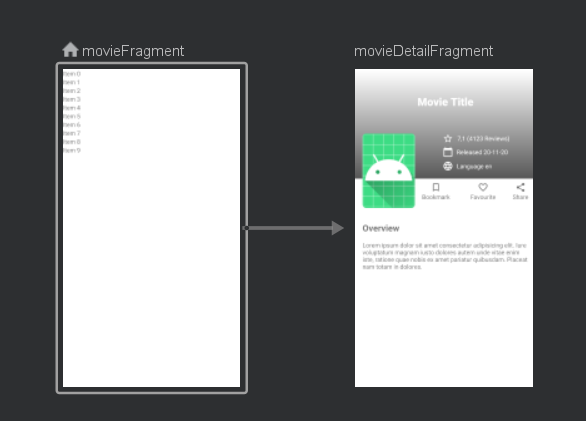
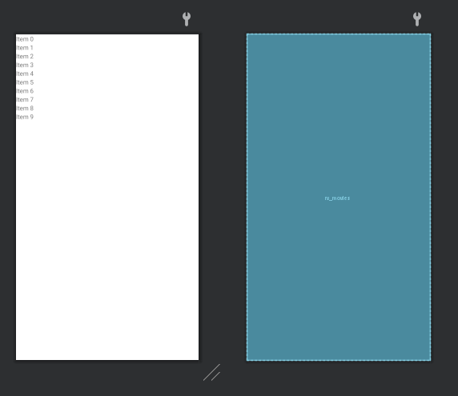
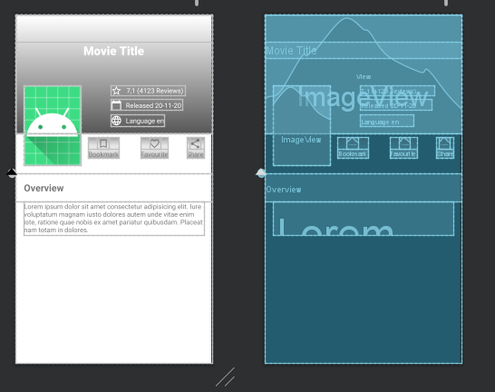
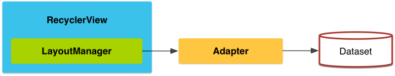

# Desarrollo de APP mobile

Esta es una aplicación que busca desarrollar varios conceptos y el uso de jetpack junto con arquitectura MVVM.


## Navigation




## Diseño menú principal y detalle








## Library Navigation

**Navigation**
```
implementation "androidx.navigation:navigation-fragment-ktx:2.3.3"
implementation "androidx.navigation:navigation-ui-ktx:2.3.3"
```

**Safe args**
```
classpath "androidx.navigation:navigation-safe-args-gradle-plugin:2.3.3"
```

**plugins**
```
id 'androidx.navigation.safeargs.kotlin'
```

## Library  Retrofit

```
implementation 'com.squareup.retrofit2:retrofit:2.9.0'
implementation 'com.google.code.gson:gson:2.8.6'
implementation 'com.squareup.retrofit2:converter-gson:2.9.0'
implementation 'com.squareup.okhttp3:logging-interceptor:4.9.0'
```

## ViewBinding

```
 buildFeatures {
        viewBinding true
    }
```


# Arquitecturas Mobile

## RecyclerView




## Modelo-Vista-ViewModel


